# Crilly's B&B

## Introduction

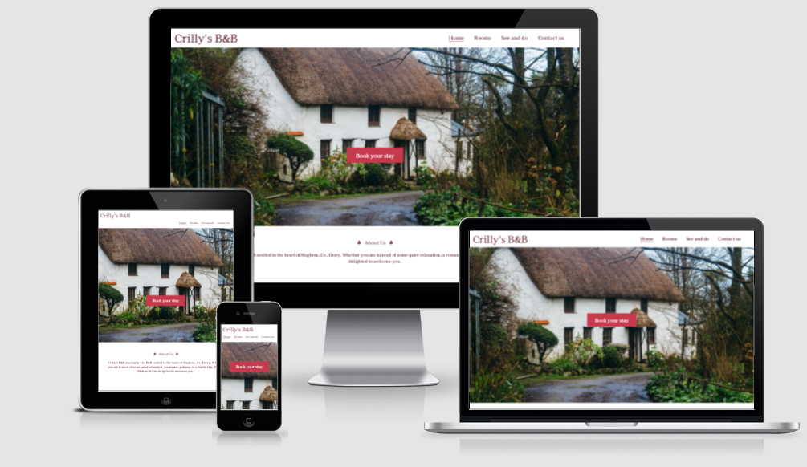

Crilly's B&B is a website for a family-owned B&B business based in the small town of Maghera, Co. Derry. The website is aimed towards any holidaymakers who are looking for a quiet holiday in relaxing surroundings.

Users of this website will be able to gain a good insight into what it is like to stay at the B&B, the available facilites and what they can expect from the local area. They will have easy access to prices and a contact page where they can send an enquiry to book their desired room. 

## User Experience (UX)

### Project Goals

* To create a minimalist, well-designed website for a small hospitality business that helps with the company's branding and increases their bookings.

### User Goals

* To learn more about the B&B, including the style and affordability.
* To easily make a booking.
* To find clear information about the B&B location and directions, the rooms, prices and facilities on offer.

### Site Owner's Goals

* To project a positive brand image.
* To get new customers.

### Target Audience

* Families looking for an affordable, low-key holiday.
* Couples looking for a remote romantic getaway.
* Solo travelers who would appreciate cosy and remote accommodation in the countryside.

### User Stories

* First Time Visitor Goals

  * As a First Time Visitor, I want to easily understand the main purpose of the site and learn more about the service on offer at the B&B.
  * As a First Time Visitor, I want to be able to easily navigate throughout the site to find content.
  * As a First Time Visitor, I want to easily find basic information about the B&B like it's location and how to reach it.
 
* Returning Visitor Goals

  * As a Returning Visitor, I want to easily access the section of the site where I can contact the organisation with queries.
  * As a Returning Visitor, I want to easily access the section of the site where I can review prices as I may now be considering booking and putting a budget together for this.
  * As a Returning Visitor, I also want to locate the business's social media links to see their followings on social media to determine how trusted and known they are, and potentially look for testimonials on these sites to understand how previous customers found the accommodation.
  
* Frequent User Goals

  * As a Frequent User, I want to be able to access the site easily from any device, even if I am on the go.
  * As a Frequent User, I want to follow the B&B on their social pages so I am aware of any updates/offers.

* Site Owner Goals

  * As a site owner, I want to create an attractive and well-designed site that elicits a positive emotional response in users so that they remain on and navigate througout the site to achieve their goals.
  * As a site owner, I want to have a clear and well-structured contact from so I can receive queries and questions from users which will potentially lead to bookings. I do not want this contact form to be too many clicks away from where the user is on the site at any given moment.
  *  As a site owner, I want to have clear social media links displayed on the site which may lead to an increased following on channels to help with my branding.

### Structure:

The site has 4 pages: 

Home page - The 'Home' page contains a Hero image of the exterior of the B&B (Often the first thing a potential customer wants to see), an eye-catching call to action booking button in the centre of the page which redirects to the Contact page, and an 'About us' section with a welcome message and brief background of the business.

Rooms -  The 'Rooms' page contains images of the two room types available and their prices, with additional 'book now' buttons which redirect to the Contact form/booking page.

See and do - The 'See and do' page contains suggestions for activities in the area which may be of interest to the B&B's guests, along with links to more information on each activity. 

Contact page - The 'Contact' page contains a contact form for customers to submit booking requests and questions to the company. This page also contains a map to the B&B and directions/transport options.

For consistency of user experience, the site logo, navigation links and footer remain consitent throughout the site.

### Wireframes:

Mock-ups were made using Balsamiq to help plan and visualise the site design. They were created for 3 main screen sizes: mobile, tablet and desktop.

- [Wireframes](docs/home-wireframes.pdf): 'Home' page.
- [Wireframes](docs/rooms-wireframes.pdf): 'Rooms' page.
- [Wireframes](docs/see-and-do-wireframes.pdf): 'See and do' page.
- [Wireframes](docs/contact-wireframes.pdf): 'Contact' page.

### Design:

* Colour Scheme:

  The colour palette includes calm and complimenting colours which suit the countryside cottage feel that the site is aiming for. The palette was chosen using the [Coolors](https://coolors.co/) colour generator website.

  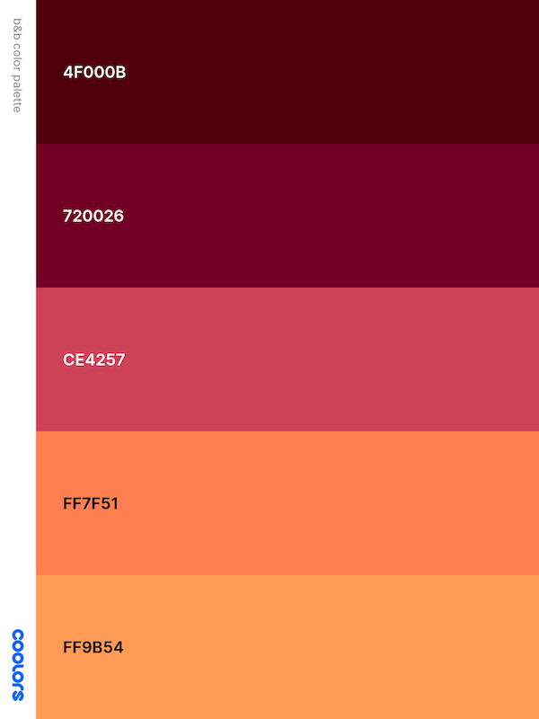

  The colours mainly used were:

  Rosewood: #4F000B

  Claret: #720026

  Brickred: #CE4257

  White was also used in different parts of the site to achieve the best possible contrast for user experience.

* Typography:

  'Kaisei HarunoUmi', taken from Google Fonts, is the main font used throughout the website with 'Sans Serif' as the fallback font. It is clear, neat and appropriate for the homely feel that the site is aiming for. 

* Imagery:

  All images were sourced from [Pexels](https://www.pexels.com/) and [Unsplash](https://unsplash.com/).

  The main image on the home page is a beautiful remote old fashioned country cottage, surrounded by nature. This aims to evoke feelings of calm. 

  The images on the 'See and do' offer a preview of the recommended local activites, and also provide a balance between imagery and text.

  The image on the 'Contact' page aims to evoke feelings of cosiness and calm and compliments the site's colour scheme.

------

## Features

### Existing Features:

* Navigation

  * Horizontally aligned navigation bar with 4 navigation links exists on all pages.

  * Navigation bar is always at the top of the page so users know what to expect and can navigate easily.

  * The site logo is clickable and allows the user to return to the homepage from anywhere on the site.

  * A border appears at the bottom of the menu links when they are hovered over.

  * On mobile, the navigation menu links are displayed underneath and to the right of the logo, instead of in-line.

Desktop:

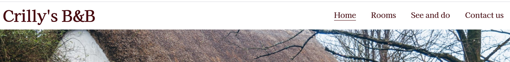

Mobile:

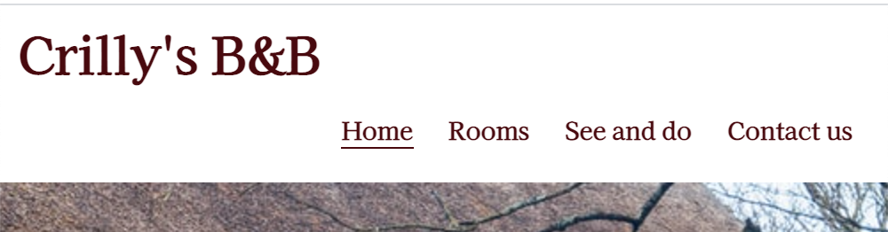

* Landing Page with a hero image

  * Large hero image serves to present the B&B in an attractive light and grab the users attention.
  * Call to action booking button is centrally placed on the hero image. The button background and text colours change on hover inviting the visitor to navigate to the contact/booking section of the site.

Desktop:

Mobile: 

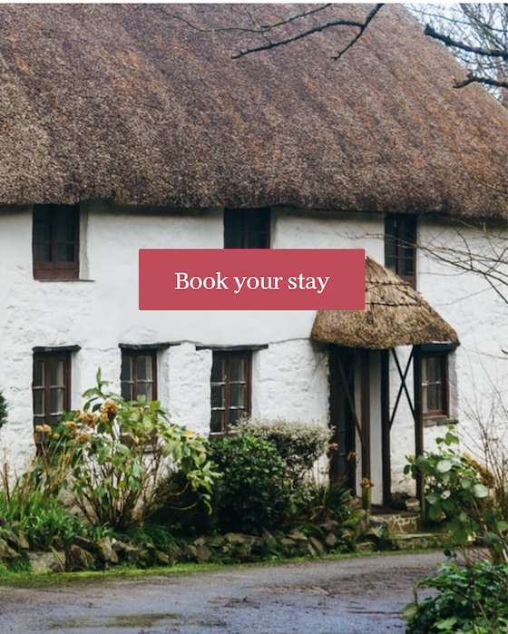

* 'About Us' section

  * This seciton provides a brief background of the B&B and a welcoming message for prospective guests.
  * Icons were added to the section heading to make the paragraph stand out and make it more appealing visually.

Desktop:

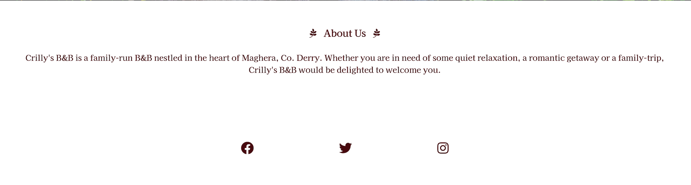

Mobile:

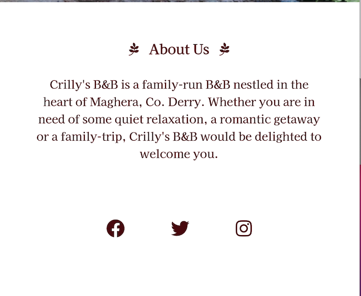

* Footer

  * Footer is conventionally placed at the bottom of the site and consistently displayed on all pages.

  * It includes centered social media links which open in new tabs. 

  * The aim is for a clean and minimalist look for the footer.

Desktop: 

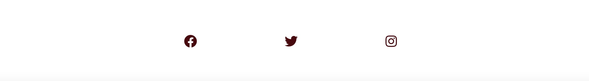

Mobile:

* Rooms 

  * The Rooms page displays two large images of available rooms at the B&B.
  * The overlay text on each image states the price per night and an additional booking button to take customers to the contact/booking page straight away.

Desktop:

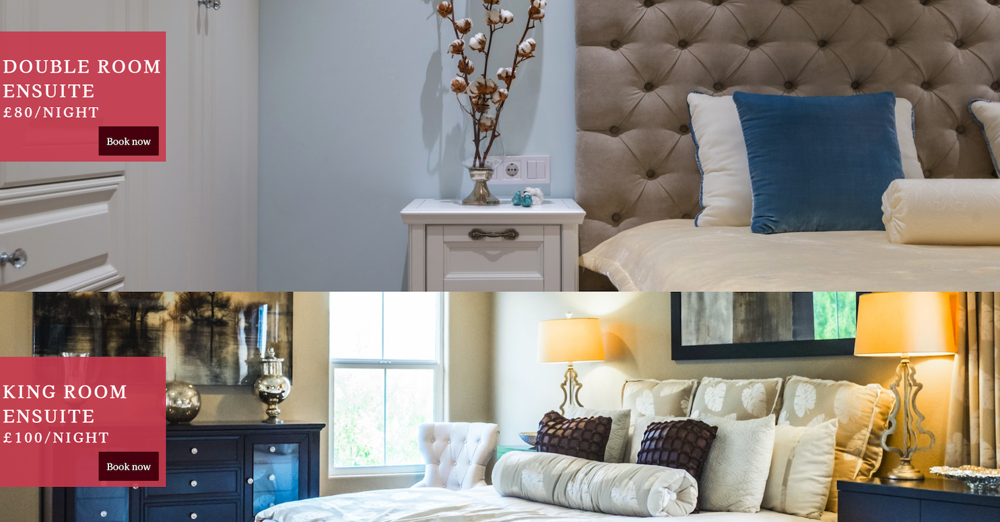

Mobile:

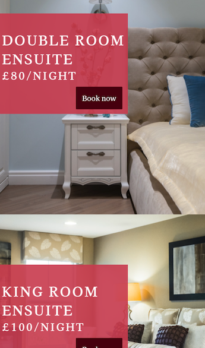

* See and do 

  * The 'See and do' page contains suggestions for recreational activities within driving distance of the B&B.
  * There is a short introductory text on each activity with an accompanying image.
  * Each activity has a link to the relevant social media or website page through which guests can find specific locations and directions. Each of these links opens in a new tab.
  * On smaller screens, the images adjust so that they become smaller to allow the full text to be seen, without stretching or distorting the images.

Desktop:

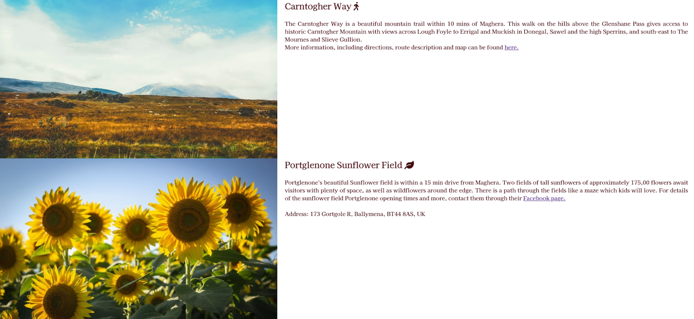

Mobile:

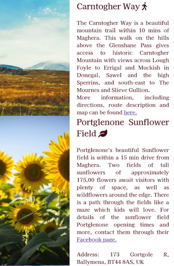

* Contact

  * The contact page contains a large image of a fireplace to evoke feelings of cosiness and warmth.
  * There is a contact form overlaying the main image where guests can submit queries or directly make a booking request. The button on this form changes colour when hovered over.
  * The name and email fields are required and a validation error message pops up if the user tries to submit the form with information missing from these fields.
  * The email addresss needs to be in a valid format - a validation error message pops up if the format is incorrect.

Desktop:

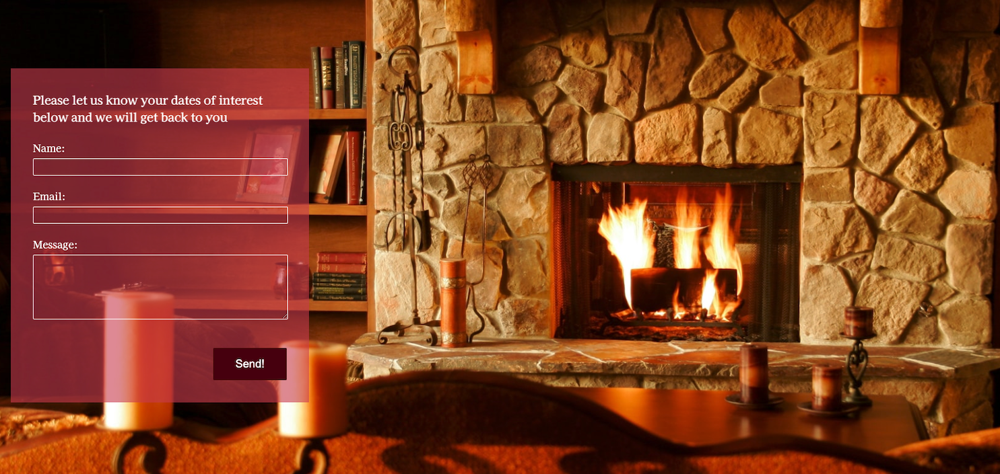

Mobile:

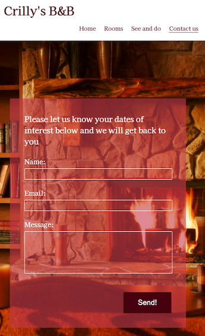

* Directions section

  * This section is located at the bottom of the Contact page and contains an embedded Google Map and Directions text.
  * On smaller screens, the map gets stacked on top of the text instead of side by side.

Desktop:

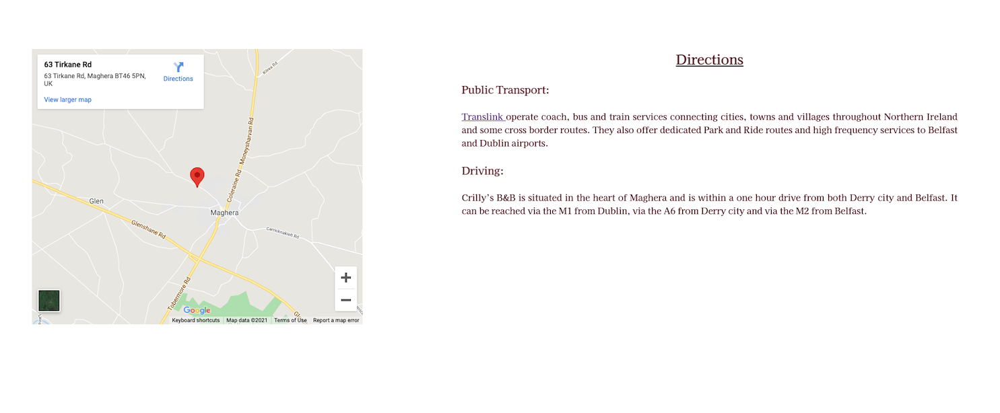

Mobile:

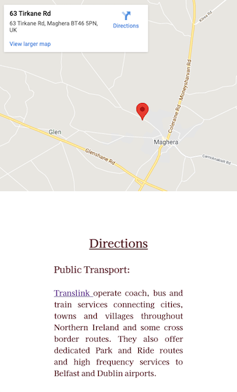

### Features To be Implemented in Future:

* Rooms page: Add more pictures of each room to give customers a better idea, possibly using a Javascript scroll function through the images.
* Contact page: Add a traditional booking form with arrival and departure dates to make the booking experience more straight forward for guests.
* Home page: Add more imagery in a gallery to give an insight into the catering services at the B&B. This gallery would also portray a diverse customer base to reflect the company's commitment to diversity and inclusion. 

## Technologies Used

### Languages:

*  [HTML 5](https://en.wikipedia.org/wiki/HTML5)
*  [CSS 3](https://en.wikipedia.org/wiki/CSS)

### Frameworks, libraries and programs used:

* [Balsamiq](https://balsamiq.com/) - to create wireframes for the site as part of the project preparation.
* [Google Fonts](https://fonts.google.com/) - to import the 'Kaisei HarunoUmi' and 'Sans Serif' fonts into the HTML file, which were then used throughout the site.
* [Font Awesome](https://fontawesome.com/) - for icons which were added to some headings throughout the site for aesthetics.
* [Coolors](https://coolors.co/) - for an appropriate and attractive colour palette.
* [Tinypng](https://tinypng.com/) - to resize images.
* [Chrome DevTools](https://developer.chrome.com/docs/devtools/) - to inspect and debug the code through all stages of the development.
* [Lighthouse](https://developers.google.com/web/tools/lighthouse) - to check the site for performance, accessibility and best practices.
* [Am I Responsive](http://ami.responsivedesign.is/) - to produce a preview of the site on different devices.
* [W3C HTML Validator](https://validator.w3.org/#validate_by_input) - to validate HTML code.
* [W3C CSS Validator](https://jigsaw.w3.org/css-validator/) - to validate CSS code.
* [GitHub](https://github.com/) - for hosting the project code and version control.
* [Gitpod](https://gitpod.io/account) - to write the code and push it to GitHub.
* [Github Pages](https://pages.github.com/) - to deploy the site.
* [Unsplash](https://unsplash.com/) - for images.
* [Pexels](https://www.pexels.com/) - for images.
* [Gimp2.10](https://www.gimp.org/) - to resize images.

# Deployment

## Deploying to GitHub Pages

The site was developed in GitPod and deployed to GitHub pages. The steps to deploy are as follows:

* Navigate to the Github repository. For this project, this is rocrill/Crilly-s-B-B. 
* Navigate to the Settings tab, then to Pages.
* From the Source secton drop-down menu, select the Master Branch ( or Branch: Master and Root folder). Save.
* Once the master branch has been selected, you will see the message: 'Your site is published' and a link to the deployed site will be provided.

The live link can be found here - https://rocrill.github.io/Crilly-s-B-B/

*Note*: I wanted to neaten the end of the url from 'Crilly-s-B-B' when deploying the site, however I was too nervous that other parts of the project would be affected. I would neaten this in future, e.g. to 'crillys-bandb'. 

## Forking to GitHub Repository

You can create a fork (copy) of the repository. This allows you to experiment with the code without affecting the original project.

To fork the repository:

1. Log in to your GitHub account.
2. On GitHub, navigate to the repository you want to fork.
3. In the top right corner of the page, underneath your profile avatar, click Fork.
4. You should now have a copy of the original repository in your GitHub account.

## Making a local clone:

You can clone your repository to create a local copy on your computer. Any changes made to the local copy will not affect the original project. To clone the Crilly-s-B-B project, follow the steps below:

1. Log in to your GitHub account and locate the Crilly-s-B-B repository.
2. In the repository, click on Code button located above all the project files.
3. Under HTTPS, copy the link generated - https://github.com/rocrill/Crilly-s-B-B.git
4. Open the terminal you are using, e.g. Gitpod
5. Change the current working directory to the location where you want the cloned directory created
6. Type git clone and then paste the URL you copied earlier: `git clone https://github.com/rocrill/Crilly-s-B-B.git`
8. Press Enter to create your local clone.

# Testing

I tested the site regularly during the development process, by previewing it in the live server window and inspecting with Google Chrome DevTools at various stages.

When I was editing for responsiveness I tested the site on several different devices.

At the final stages of the project the W3C Markup Validator and W3C CSS Validator Services were used to validate every page of the project to ensure there were no syntax errors.

## Testing User Stories from the UX Section

* First time visitor goals:

  * As a First Time Visitor, I want to easily understand the main purpose of the site and learn more about the service  on offer at the B&B.

    Test result: Pass

    On the landing page of the site, there is a clear call to action to book accommodation at the B&B. There is also a nav menu with clear purpose of providing more information about the B&B and things to do in the area.

    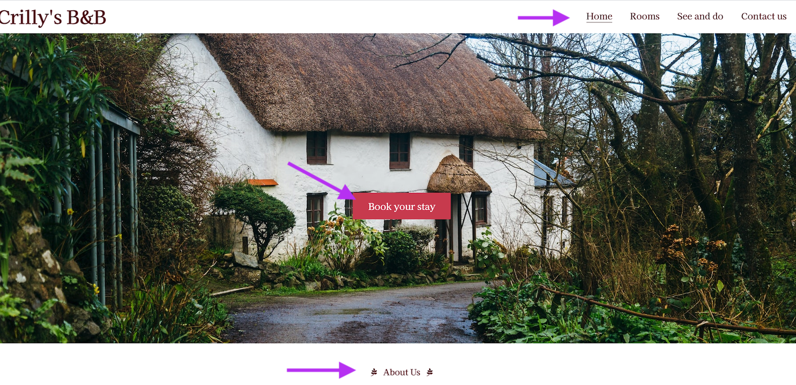

  * As a First Time Visitor, I want to be able to easily navigate throughout the site to find content.

    Test result: Pass

    The navigation menu clearly outlines the purppose of each page, was designed in the order of a typical guest journey throughout a hospitality website, and is consistent throughout the site to make navigation seamless.

    

  * As a First Time Visitor, I want to easily find basic information about the B&B like it's location and how to reach it.

    Test result: Pass

    Directions to the site can be found predictably on the 'Contact' page, including a Google Map, driving directions and a link to the site of the main Northern Ireland public transort provider, which opens in a new tab.

    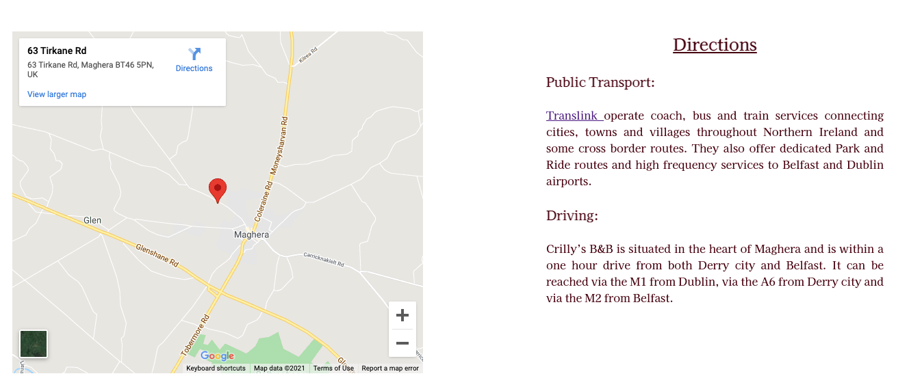

* Returning Visitor Goals

  * As a Returning Visitor, I want to easily access the section of the site where I can contact the organisation with queries.

    Test result: Pass

    The Contact page is clearly marked in nav menu, where there is an straightforward contact form which highlights when required info is missing to ensure customer queries are not lost.

    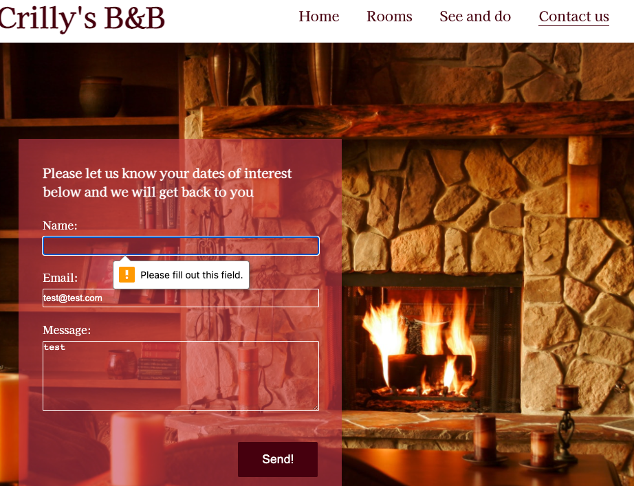

  * As a Returning Visitor, I want to easily access the section of the site where I can review prices as I may now be considering booking and putting a budget together for this.

    Test result: Pass

    Prices are stated in clear capitalized text on each room image, which can be found intuitively on the Rooms page.

    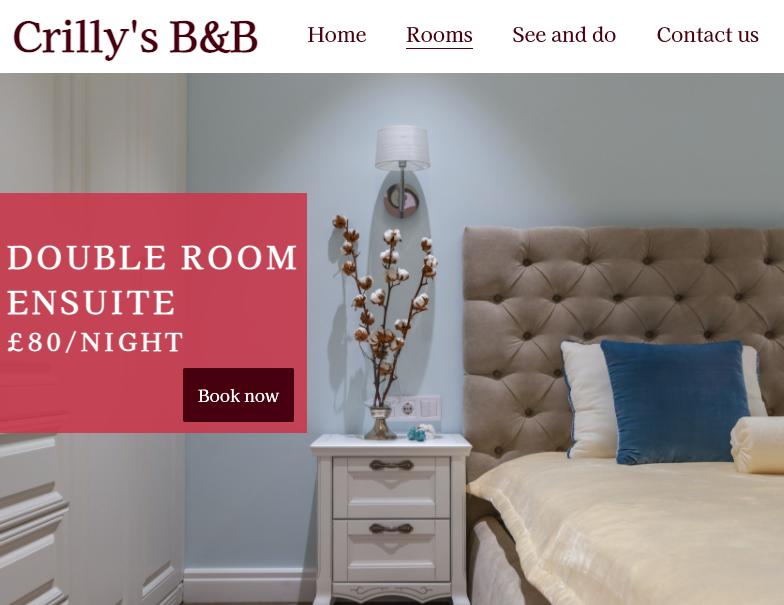

  * As a Returning Visitor, I also want to locate the business's social media links to see their followings on social media to determine how trusted and known they are, and potentially look for testimonials on these sites to understand how previous customers found the accommodation.

    Test result: Pass

    The business's social media links are clearly displayed in the footer on all pages of the site. Each social media channel icon opens in a separate tab.

    

* Frequent User Goals

  * As a Frequent User, I want to be able to access the site easily from any device, even if I am on the go.

    Test result: Pass.

    The site has been made responsive through multiple media queries, so the site layout and user experience is not adversely affected when accessed on a smaller screensize.

    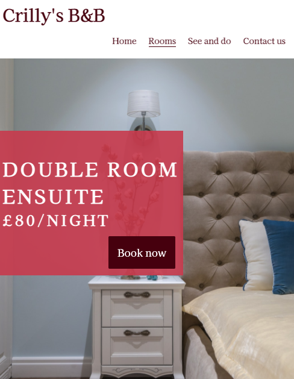

  * As a Frequent User, I want to follow the B&B on their social pages so I am aware of any updates/offers.

    Test result: Pass.

    The social media links are defined by their trademark icons, and clearly displayed on all pages of the site so that users can click through to the site on a new tab and follow if they wish.

* Site Owner Goals

  * As a site owner, I want to create an attractive and well-designed site that elicits a positive emotional resonse in users so that they remain on and navigate througout the site to achieve their goals.

    Test result: Pass.

    The website was designed with a complementary color palette and an intuitive layout, with minimal text and imagery to avoid information or sensory overload. Navigation throughout the site is simple and straightforward, and the imagery used was chosen to convey a sense of calm and warmth. All of these features have the aim of a positive emotional response from users.

  * As a site owner, I want to have a clear and well-structured contact from so I can receive queries and questions from users which will potentially lead to bookings. I do not want this contact form to be too many clicks away from where the user is on the site at any given moment.

    Test result: Pass

    The contact form is simple and easy to use. It highlights when rewuired information is missing and leads to a confirmation message when a message is sent. 
    
    It can be accessed by navigating to the Contact form on the nav menu, by clicking the 'Book your stay' button on the Home page, or by clicking each 'Book now' button underneath the separate room prices on the Rooms page.

      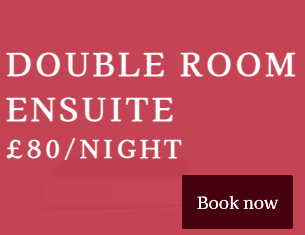
      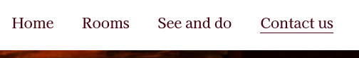
      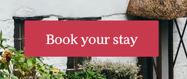

  * As a site owner, I want to have clear social media links displayed on the site which may lead to an increased following on channels to help with my branding.

    Test result: Pass

    The social media links are defined by their trademark icons, and clearly displayed on all pages of the site so that users can click through to the site on a new tab, get a better feel for the company's branding and follow the page if they wish.

## Validator Testing

* HTML Validator Errors & Warnings:

  * Warning: Section lacks heading. Consider using h2-h6 elements to add identifying headings to all sections.

    Fixed: Changed a `section` element to a `div` element as the heading was not required.

  * Error: The element `button` must not appear as a descendant of the `a` element.

    Fixed: Replaced `button` element with an `input` within a `form`.

  * Error: The value of the `for` attribute of the `label` element must be the ID of a non-hidden form control.

    Fixed: Changed 'message' `class` to an `id` and matched the attribute value between the `label` and `textarea` elements.

* CSS Validator Errors & Warnings

  * Error: .attractions-container: `left` is not a `align-items` value.

  * Fix: Replaced code with `align-items: stretch;`

I re-ran the deployed site through both the HTML and CSS validators and no warnings or error were found:

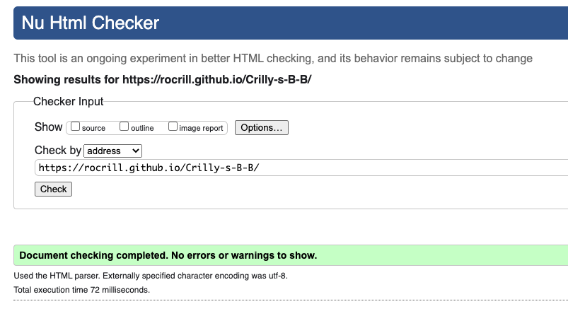
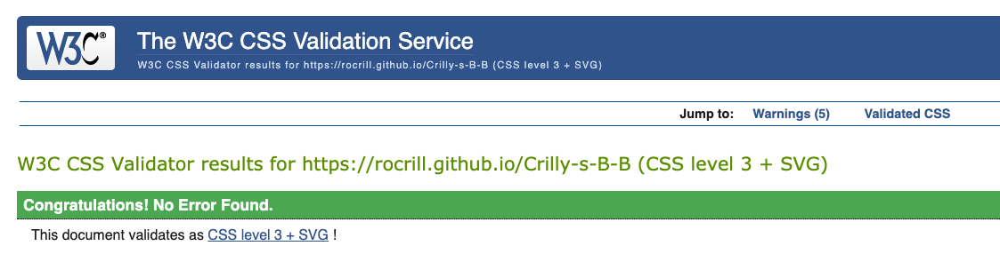

## Lighthouse Testing

The Lighthouse report from Google Chrome DevTools showed very good results for Performance, Accessibility, SEO and best practices of the site. 

Home page: 

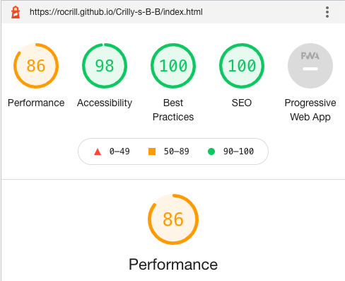

Rooms page: 

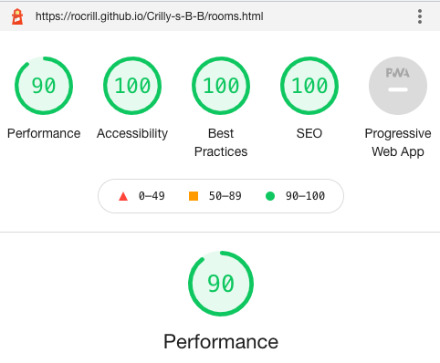

See and do page: 

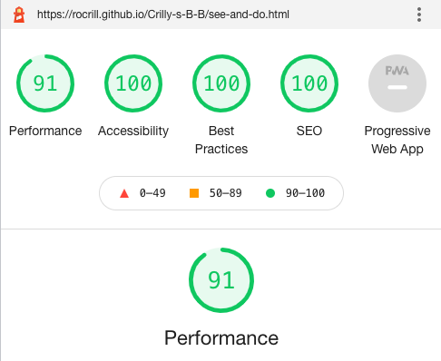

Contact page:

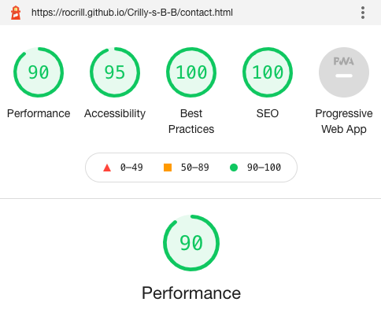

## Further Testing

* Devices and browsers :

  * The Website was tested on multiple browsers - Google Chrome, Safari, Microsoft Edge and Firefox browsers.
  * The website was viewed on all devices available to me - Desktop, Laptop, iPhone6, Huawei Y6 and Oppo Find X2 Lite.

* Site Features:

  * The nav bar remains and the top of the page and the menu items adapt to remain within the nav bar on all devices.
  * The font is legible on all device sizes.
  * Images are resized where needed and never stretched or distorted on smaller devices.
  * All buttons and links direct to the correct parts of the site.

## Bugs

* Fixed:
  * At a later stage of the project I realised that on an actual iPhone 6, as opposed to the iPhone6 preview in DevTools, certain sections of the site were distorted, e.g. the nav menu items fell outside of the header. This was solved with `&nbsp` html. 
  * The 'Book now' button of the Rooms page was also displaced on the actual iPhone 6. This was fixed using CSS for this button within the mobile media query.
  * The button stying across the whole site on the iPhone6 was missing, this was resolved by adding `-webkit-appearance: none;` to the CSS for the styling of each button.
  * There was a 'Book now' button placement issue on Firefox desktop. This was resolved by using `&nbsp;` and increasing the width of the room price container.
  
* Known:
  * On a medium size device between desktop and mobile, on the Contact page, the Google Map does not centre perfectly over the Directions paragraph as it does in mobile. I spent a lot of time trying to fix this, but in the end did not have time to fix it without compromising the site on the desktop on mobile verions - on which I am happy with the map positioning.

    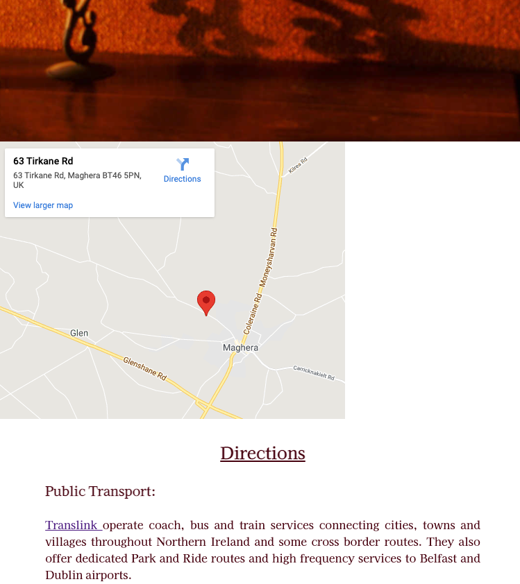

# Credits

## Code

The Code Institute LMS content, including the Love Running project, as well as some posts on Stackoverflow were used to create this site. All code taken from these resources has been adapted to suit the needs of this site, except for the specific cases referenced below.

This [W3Schools](https://www.w3schools.com/css/css3_flexbox_container.asp) article was used when writing the code to stack containers for the mobile view of the Contact page.

Code used to centre Google map within half of a container on Contact page was taken from this [w3 doc](https://www.w3.org/Style/Examples/007/center.en.html#block)

This [Stack Overflow](https://stackoverflow.com/questions/26744659/center-an-button-with-respect-to-an-image-css) article was used to centre the 'Book your stay' button on the Home page hero image.

This [W3Schools](https://www.w3schools.com/howto/howto_css_center-vertical.asp) article was used for further repositioning of buttons on the site.

This [W3Schools](https://www.w3schools.com/html/html_entities.asp) article was used for the `&nbsp;` html to manipulate space around text throughout the site.

This [W3Schools](https://www.w3docs.com/snippets/css/how-to-vertically-align-text-next-to-an-image.html) article was used when writing the code to display images beside the text on the 'See and do' page.

This [Stack Overflow](https://stackoverflow.com/questions/5438567/css-submit-button-weird-rendering-on-ipad-iphone) article resolved a formatting issue on all buttons across the site whereby the correct styling was not applied.

Icons taken from [Font Awesome](https://fontawesome.com/).

## Content

Some information on Portstewart beach taken from the [National Trust](https://www.nationaltrust.org.uk/portstewart-strand) site.

Some content for the Carntogher walk description taken from [Walk NI](https://walkni.com/walks/carntogher-way-sli-an-chairn/).

Some content for Portglenone Sunflower field taken from [Passports and Adventures](https://passportsandadventures.com/sunflower-fields-in-ireland-with-kids/).

## Images

Images were sourced from Unsplash and Pexels.

Hero image by Mike Erskine on [Unsplash](https://unsplash.com/photos/NqeB4q6KOFg)

Double room image by Max Vakhtbovych on [Pexels](https://www.pexels.com/photo/classy-bedroom-with-soft-bed-and-white-furniture-7166560/)

King room image by NeONBRAND on [Unsplash](https://unsplash.com/photos/ZqqwJA71Ke4)

Sunflower field image by Bonnie Kittle on [Unsplash](https://unsplash.com/photos/vxTpVxYCZjA)

Mountain image by K. Mitch Hodge on [Unsplash](https://unsplash.com/photos/pyKlWqt6PY0)

Portstewart Strand image by Catherin Auld on [Unsplash](https://unsplash.com/photos/7H7COlMWZwI)

Contact page image by Timothy Eberly on [Unsplash](https://unsplash.com/photos/oIFAIo6f2qA)

# Acknowledgements

Thank you to:

* My mentor, Gerard McBride, for his help and guidance.
* The tutors at the Code Institute for their help and support.

------
