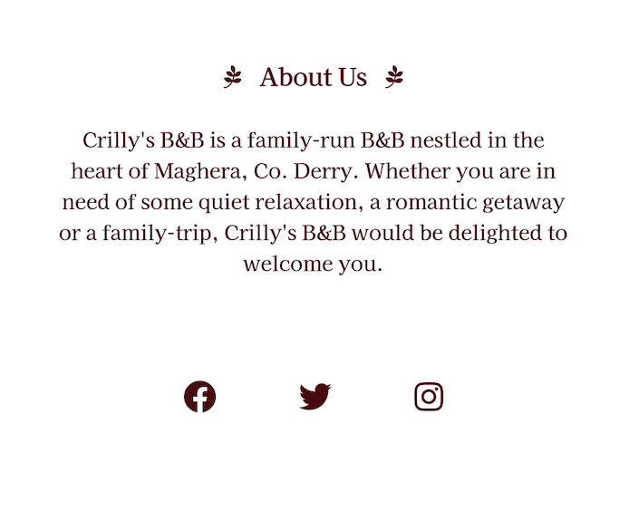

# Crilly's B&B

## Introduction

Crilly's B&B is a website for a small B&B business based in the small town of Maghera, Co. Derry. The website is aimed towards any holidaymakers who are looking for a quiet holiday in relaxing surroundings.

Users of this website will be able to gain a good insight into what it is like to stay at the B&B, the available facilites and what they can expect from the local area. They will have easy access to prices and contact page where they can send an enquiry to book their desired room. 

## User Experience (UX)

### Project Goals

* To create a minimalist, well-designed website for a small hospitality business that helps with the company's branding and increases their bookings.

### User Goals

* To learn more about the B&B, including the style and affordability.
* To easily make a booking.
* To find clear information about the B&B location and directions, the rooms, prices and facilities on offer.

### Site Owner's Goals

* To project a positive brand image.
* To get new customers.

### Target Audience

* Families looking for an affordable, low-key holiday.
* Couples looking for a remote romantic getaway.
* Solo travelers who would appreciate cosy and remote accommodation in the countryside.

### User Stories

* First Time Visitor Goals

  * As a First Time Visitor, I want to easily understand the main purpose of the site and learn more about the service on offer at the B&B.
  * As a First Time Visitor, I want to be able to easily navigate throughout the site to find content.
  * As a First Time Visitor, I want to easily find basic information about the B&B like it's location and how to reach it.
 
* Returning Visitor Goals

  * As a Returning Visitor, I want to easily access the section of the site where I can contact the organisation with queries.
  * As a Returning Visitor, I want to easily access the section of the site where I can review prices as I may now be considering booking and putting a budget together for this.
  * As a Returning Visitor, I also want to locate the business's social media links to see their followings on social media to determine how trusted and known they are, and potentially look for testimonials on these sites to understand how previous customers found the accommodation.
  
* Frequent User Goals

  * As a Frequent User, I want to be able to access the site easily from any device, even if I am on the go.
  * As a Frequent User, I want to follow the B&B on their social pages so I am aware of any updates/offers.

* Site Owner Goals

  * As a site owner, I want to create an attractive and well-designed site that elicits a positive emotional resonse in users so that they remain on and navigate througout the site to achieve their goals.
  * As a site owner, I want to have a clear and well-structured contact from so I can receive queries and questions from users which will potentially lead to bookings.
  *  As a site owner, I want to have clear social media links displayed on the site which may lead to an increased following on channels to help with my branding.

### Structure:

The site has 4 pages: 

Home page - The 'Home' page contains a Hero image of the exterior of the B&B (Often the first thing a potential customer wants to see), an eye-catching call to action booking button in the centre of the page which redirects to the Contact page, and an 'About us' section with a welcome message and brief background of the business.

Rooms -  The 'Rooms' page contains images of the two room types available and their prices, with additional 'book now' buttons which redirect to the Contact form/booking page.

See and do - The 'See and do' page contains suggestions for activities in the area which may be of interest to the B&B's guests, along with links to more information on each activity. 

Contact page - The 'Contact' page contains a contact form for customers to submit booking requests and questions to the company. This page also contains a map to the B&B and directions/transport options.

For consistency of user experience, the site logo, navigation links and footer remain consitent throughout the site.

### Wireframes:

Mock-ups were made using Balsamiq to help plan and visualise the site design. They were created for 3 main screen sizes: mobile, tablet and desktop.

> - [Wireframes](docs/home-wireframes.pdf): 'Home' page.
> - [Wireframes](docs/rooms-wireframes.pdf): 'Rooms' page.
> - [Wireframes](docs/see-and-do-wireframes.pdf): 'See and do' page.
> - [Wireframes](docs/contact-wireframes.pdf): 'Contact' page.

### Design:

* Colour Scheme:

The colour palette includes calm and complimenting colours which suit the countryside cottage feel that the site is aiming for. The palette was chosen using the [Coolors](https://coolors.co/) colour generator website.

The colours mainly used were:

Rosewood: #4F000B

Claret: #720026

Brickred: #CE4257

White was also used in different parts of the site to achieve the best possible contrast for user experience.

* Typography:
'Kaisei HarunoUmi', taken from Google Fonts, is the main font used throughout the website with 'Sans Serif' as the fallback font. It is clear, neat and appropriate for the homely feel that the site is aiming for. 

* Imagery:

All images were sourced from [Pexels](https://www.pexels.com/) and [Unsplash](https://unsplash.com/).

The main image on the home page is a beautiful remote old fashioned country cottage, surrounded by nature. This aims to evoke feelings of calm. 

The images on the 'See and do' offer a preview of the recommended local activites, and also provide a balance between imagery and text.

The image on the 'Contact' page aims to evoke feelings of cosiness and calm and compliments the site's colour scheme.

------

## Features

### Existing Features:

* Navigation

  * Horizontally aligned navigation bar with 4 navigation links exists on all pages.

  * Navigation bar is always at the top of the page so users know what to expect and can navigate easily.

  * The site logo is clickable and allows the user to return to the homepage from anywhere on the site.

  * A border appears at the bottom of the menu links when they are hovered over.

  * On mobile, the navigation menu links are displayed underneath and to the right of the logo, instead of in-line.

Desktop:

Mobile:

* Landing Page with a hero image

  * Large hero image serves to present the B&B in an attractive light and grab the users attention.
  * Call to action booking button is centrally placed on the hero image. The button background and text colours change on hover inviting the visitor to navigate to the contact/booking section of the site.

Desktop:

Mobile: 

* 'About Us' section
  * This seciton provides a brief background of the B&B and a welcoming message for prospective guests.
  * Icons were added to the section heading to make the paragraph stand out and make it more appealing visually.

Desktop:

Mobile:

* Footer

  * Footer is conventionally placed at the bottom of the site and consistently displayed on all pages.

  * It includes centered social media links which open in new tabs. 

Desktop: 

Mobile:

* Rooms 

* See and do 

### Features To be Implemented in Future:

-

## Technologies Used

## Deployment

## Testing

The W3C Markup Validator and W3C CSS Validator Services were used to validate every page of the project to ensure there were no syntax errors in the project.

W3C Markup Validator - Results
W3C CSS Validator - Results

#Testing User Stories

#Further Testing

The Website was tested on Google Chrome, Internet Explorer, Microsoft Edge and Safari browsers.
The website was viewed on a variety of devices such as Desktop, Laptop, iPhone6 and Oppo Find X2 Lite.

## Credits

### Code

The Code Institute LMS content as well as some posts on Stackoverflow were used to create this site. All code taken from these resources has been adapted to suit the needs of this site, except for the specific cases referenced below.

Reference materials from xxx were used to implement xxx.

xxx was taken from this xxx post.

Icons taken from Font Awesome.

## Acknowledgements

------
